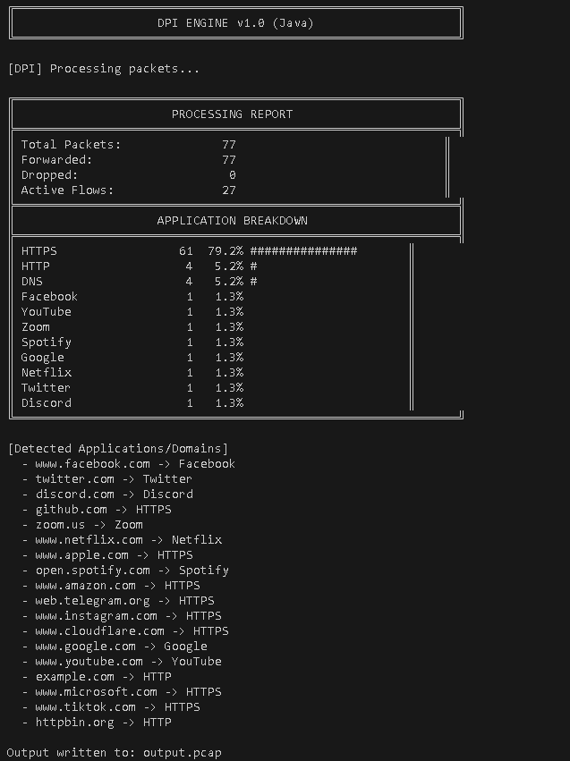

# DPI Engine (Java) - Deep Packet Inspection System

This document explains everything about this project - from basic networking concepts to the complete code architecture. After reading this, you should understand exactly how packets flow through the system without needing to read the code.

---

## Table of Contents

1. [What is DPI?](#1-what-is-dpi)
2. [Networking Background](#2-networking-background)
3. [Project Overview](#3-project-overview)
4. [File Structure](#4-file-structure)
5. [The Journey of a Packet (Java Implementation)](#5-the-journey-of-a-packet-java-implementation)
6. [Conceptual Extension: Multi-threaded Design](#6-conceptual-extension-multi-threaded-design)
7. [How SNI Extraction Works](#7-how-sni-extraction-works)
8. [How Blocking Works](#8-how-blocking-works)
9. [Building and Running](#9-building-and-running)
10. [Understanding the Output](#10-understanding-the-output)
11. [Output Screenshot](#11-output-screenshot)

---

## 1. What is DPI?

Deep Packet Inspection (DPI) is a technology used to examine the contents of network packets as they pass through a checkpoint. Unlike simple firewalls that only look at packet headers (such as IP addresses and ports), DPI looks inside the packet payload.

### Real-World Uses:

- **ISPs**: Throttle or block certain applications (e.g., BitTorrent).
- **Enterprises**: Block social media on corporate networks.
- **Parental Controls**: Block inappropriate websites.
- **Security**: Detect malware payloads or intrusion attempts.

### What Our DPI Engine Does:

```text
User Traffic (PCAP) ──► [DPI Engine] ──► Filtered Traffic (PCAP)
                             │
                             ├── Identifies apps (YouTube, Facebook, etc.)
                             ├── Blocks based on rules
                             └── Generates reports
```

---

## 2. Networking Background

### The Network Stack (Layers)

When you visit a website, data travels through multiple "layers":

┌─────────────────────────────────────────────────────────┐
│ Layer 7: Application │ HTTP, TLS (HTTPS), DNS │
├─────────────────────────────────────────────────────────┤
│ Layer 4: Transport │ TCP (reliable), UDP (fast) │
├─────────────────────────────────────────────────────────┤
│ Layer 3: Network │ IP addresses (routing) │
├─────────────────────────────────────────────────────────┤
│ Layer 2: Data Link │ MAC addresses (local network)│
└─────────────────────────────────────────────────────────┘

### A Packet's Structure

Every network packet is structured with headers wrapping inside headers:

┌──────────────────────────────────────────────────────────────────┐
│ Ethernet Header (14 bytes) │
│ ┌──────────────────────────────────────────────────────────────┐ │
│ │ IP Header (20 bytes) │ │
│ │ ┌──────────────────────────────────────────────────────────┐ │ │
│ │ │ TCP Header (20 bytes) │ │ │
│ │ │ ┌──────────────────────────────────────────────────────┐ │ │ │
│ │ │ │ Payload (Application Data) │ │ │ │
│ │ │ │ e.g., TLS Client Hello with SNI │ │ │ │
│ │ │ └──────────────────────────────────────────────────────┘ │ │ │
│ │ └──────────────────────────────────────────────────────────┘ │ │
│ └──────────────────────────────────────────────────────────────┘ │
└──────────────────────────────────────────────────────────────────┘

### The Five-Tuple

A connection (or "flow") is uniquely identified by 5 values:

| Field                | Example           | Purpose                              |
| -------------------- | ----------------- | ------------------------------------ |
| **Source IP**        | `192.168.1.100`   | Who is sending the packet            |
| **Destination IP**   | `142.250.185.110` | Where it is going                    |
| **Source Port**      | `54321`           | Sender's application identifier      |
| **Destination Port** | `443`             | Service being accessed (443 = HTTPS) |
| **Protocol**         | `6` (TCP)         | Transport protocol type (TCP or UDP) |

**Why is this important?**

- All packets sharing the same 5-tuple (or its reverse) belong to the same connection conversation.
- If we block one packet of a connection, we should statefully block all subsequent packets in both directions (bidirectional flow tracking).

### What is SNI?

Server Name Indication (SNI) is part of the TLS/HTTPS handshake. When you visit `https://www.youtube.com`:

1. Your browser sends a **Client Hello** message.
2. This message includes the domain name in **plaintext** (before encryption begins).
3. The server uses this to know which SSL/TLS certificate to present.

```text
TLS Client Hello:
├── Version: TLS 1.2 / 1.3
├── Random: [32 bytes]
├── Session ID Length: [1 byte]
├── Cipher Suites
└── Extensions:
    └── SNI Extension:
        └── Server Name: "www.youtube.com"  ← We extract THIS!
```

Even though HTTPS is encrypted, the domain name is visible in the first packet!

---

## 3. Project Overview

### What This Project Does

```text
┌─────────────┐     ┌─────────────┐     ┌─────────────┐
│ Wireshark   │     │ DPI Engine  │     │ Output      │
│ Capture     │ ──► │ (Java)      │ ──► │ PCAP        │
│ (input.pcap)│     │             │     │ (filtered)  │
└─────────────┘     └─────────────┘     └─────────────┘
```

---

## 4. File Structure

```text
NetFlowEngine/
├── pom.xml                                      # Maven build configuration
├── generate_test_pcap.py                        # Script to generate test captures
├── test_dpi.pcap                                # Sample capture with various traffic
└── src/
    └── main/
        └── java/
            └── com/
                └── netflowengine/
                    ├── Main.java                # Application entry point & flow tracker
                    ├── PacketParser.java        # Decodes L2-L4 network headers
                    ├── PcapReader.java          # Handles reading raw PCAP files
                    ├── SniExtractor.java        # Performs DPI to extract TLS SNI and HTTP Host
                    └── Types.java               # Common structures (Flow, 5-Tuple, AppType)
```

---

## 5. The Journey of a Packet (Java Implementation)

Let's trace how a single packet is processed in `Main.java`:

### Step 1: Open PCAP File

We open the input file and create a handle for the filtered output capture:

```java
try (PcapReader reader = new PcapReader();
     FileOutputStream output = new FileOutputStream(outputFile)) {
    if (!reader.open(inputFile)) {
        System.err.println("Error: Cannot open input file");
        return;
    }
    output.write(reader.getGlobalHeaderBytes());
```

### Step 2: Read Each Packet

We loop to read packets sequentially:

```java
Types.RawPacket raw = new Types.RawPacket();
while (reader.readNextPacket(raw)) {
    totalPackets++;
```

### Step 3: Parse Protocol Headers

We decode headers using bitwise math in `PacketParser.java`:

```java
if (!PacketParser.parse(raw, parsed)) continue;
if (!parsed.hasIp || (!parsed.hasTcp && !parsed.hasUdp)) continue;
```

- **Ethernet Header**: Extract 16-bit EtherType: `int etherType = ((raw.data[12] & 0xFF) << 8) | (raw.data[13] & 0xFF);`
- **IPv4 Header**: Extract Internet Header Length (IHL): `int ihl = raw.data[14] & 0x0F;`
- **TCP Header**: Extract Data Offset: `int tcpOffset = (raw.data[transportOffset + 12] >> 4) & 0x0F;`
- **UDP Header**: Decodes 16-bit ports and payload offsets.

### Step 4: Create Normalized Five-Tuple

To track the connection bidirectionally (Client ──► Server and Server ──► Client as a single flow), we normalize the IPs and ports:

```java
Types.FiveTuple tuple = Types.FiveTuple.create(
    Types.parseIP(parsed.srcIp),
    Types.parseIP(parsed.dstIp),
    parsed.srcPort,
    parsed.dstPort,
    parsed.protocol
);
Types.Flow flow = flows.computeIfAbsent(tuple, k -> {
    Types.Flow f = new Types.Flow();
    f.tuple = tuple;
    return f;
});
```

### Step 5: Deep Packet Inspection (DPI)

If the traffic is HTTP (port 80) or HTTPS (port 443), we inspect the application layer payload:

```java
// For TLS (HTTPS) on port 443:
if ((flow.appType == Types.AppType.UNKNOWN || flow.appType == Types.AppType.HTTPS) &&
    flow.sni.isEmpty() && parsed.hasTcp && parsed.dstPort == 443) {
    if (parsed.payloadLen > 5) {
        String sni = SniExtractor.extractSni(raw.data, parsed.payloadOffset, parsed.payloadLen);
        if (sni != null) {
            flow.sni = sni;
            flow.appType = Types.sniToAppType(sni);
        }
    }
}
```

### Step 6: Check Blocking Rules

Evaluate blocking rules against the packet's source IP and the flow's identified application and domain:

```java
if (!flow.blocked) {
    flow.blocked = rules.isBlocked(Types.parseIP(parsed.srcIp), flow.appType, flow.sni);
}
```

### Step 7: Forward or Drop

Write the packet to the output PCAP file if the flow is not blocked:

```java
if (flow.blocked) {
    dropped++;
} else {
    forwarded++;
    byte[] pktHdr = new byte[16];
    PcapReader.writeInt32(pktHdr, 0, raw.header.tsSec, reader.isLittleEndian());
    PcapReader.writeInt32(pktHdr, 4, raw.header.tsUsec, reader.isLittleEndian());
    PcapReader.writeInt32(pktHdr, 8, raw.header.inclLen, reader.isLittleEndian());
    PcapReader.writeInt32(pktHdr, 12, raw.header.origLen, reader.isLittleEndian());
    output.write(pktHdr);
    output.write(raw.data);
}
```

---

## 6. Conceptual Extension: Multi-threaded Design

In high-performance or enterprise networking, DPI engines use a multi-threaded architecture (like in C++ or advanced Java pipelines) to handle heavy traffic loads:

### Architecture Overview

```text
                    ┌─────────────────┐
                    │  Reader Thread  │
                    │  (reads PCAP)   │
                    └────────┬────────┘
                             │
              ┌──────────────┴──────────────┐
              │      hash(5-tuple) % 2      │
              ▼                             ▼
    ┌─────────────────┐           ┌─────────────────┐
    │  LB0 Thread     │           │  LB1 Thread     │
    │  (Load Balancer)│           │  (Load Balancer)│
    └────────┬────────┘           └────────┬────────┘
             │                             │
      ┌──────┴──────┐               ┌──────┴──────┐
      │hash % 2     │               │hash % 2     │
      ▼             ▼               ▼             ▼
┌──────────┐ ┌──────────┐   ┌──────────┐ ┌──────────┐
│FP0 Thread│ │FP1 Thread│   │FP2 Thread│ │FP3 Thread│
│(Fast Path)│ │(Fast Path)│   │(Fast Path)│ │(Fast Path)│
└─────┬────┘ └─────┬────┘   └─────┬────┘ └─────┬────┘
      │            │              │            │
      └────────────┴──────────────┴────────────┘
                          │
                          ▼
              ┌───────────────────────┐
              │   Output Queue        │
              └───────────┬───────────┘
                          │
                          ▼
              ┌───────────────────────┐
              │  Output Writer Thread │
              │  (writes to PCAP)     │
              └───────────────────────┘
```

- **Load Balancers (LBs)**: Work is distributed across parallel Fast Paths.
- **Fast Paths (FPs)**: Process the actual deep packet inspection.
- **Consistent Hashing**: A hash of the 5-tuple ensures that all packets belonging to the same connection flow are processed by the same Fast Path thread. This guarantees stateful consistency without complex locks.
- **Thread-Safe Queues**: Pass packets safely between threads using mutexes and condition variables.

---

## 7. How SNI Extraction Works

### TLS Client Hello Structure

To extract the domain name from a TLS Client Hello, the code navigates the byte payload step-by-step:

```text
TLS Record Layer (5 bytes)
├── Content Type: 0x16 (Handshake)
├── Version: TLS 1.0 (0x0301)
└── Length: Record Length
Handshake Layer
├── Handshake Type: 0x01 (Client Hello)
├── Length: Handshake Length
└── Client Hello Body
    ├── Client Version (2 bytes)
    ├── Random (32 bytes)
    ├── Session ID Length (1 byte) -> Skip Session ID bytes
    ├── Cipher Suites Length (2 bytes) -> Skip Cipher Suite bytes
    ├── Compression Methods Length (1 byte) -> Skip Compression bytes
    └── Extensions Length (2 bytes)
        └── Loop through Extensions:
            ├── Extension Type (2 bytes) -> Look for Type 0x0000 (SNI)
            ├── Extension Length (2 bytes)
            └── Extension Data
                └── SNI List Length (2 bytes)
                    └── SNI Entry:
                        ├── SNI Type (1 byte) -> 0x00 (hostname)
                        └── SNI Length (2 bytes) -> Extract Hostname string!
```

---

## 8. How Blocking Works

```text
Packet Arrives
      │
      ▼
┌─────────────────────────────────┐
│ Is source IP in blocked list?   │──Yes──► DROP (State: dropped++)
└───────────────┬─────────────────┘
                │No
                ▼
┌─────────────────────────────────┐
│ Is app type in blocked list?    │──Yes──► DROP (State: dropped++)
└───────────────┬─────────────────┘
                │No
                ▼
┌─────────────────────────────────┐
│ Does SNI match blocked domain?  │──Yes──► DROP (State: dropped++)
└───────────────┬─────────────────┘
                │No
                ▼
            FORWARD (Written to output.pcap)
```

---

## 9. Building and Running

### Requirements

- **Java 17** or higher
- **Maven 3.6+**

### Building the Project

Package the project into an executable JAR:

```bash
mvn clean package
```

### Running the Engine

#### Option A: Running Directly with Maven (Development)

_On PowerShell / Windows Command Prompt:_

```powershell
mvn exec:java "-Dexec.mainClass=com.netflowengine.Main" "-Dexec.args=test_dpi.pcap output.pcap [options]"
```

_On Linux / macOS / Git Bash:_

```bash
mvn exec:java -Dexec.mainClass="com.netflowengine.Main" -Dexec.args="test_dpi.pcap output.pcap [options]"
```

#### Option B: Running the Executable JAR (Production)

```bash
java -jar target/dpi-engine-1.0-SNAPSHOT.jar input.pcap output.pcap [options]
```

### Command Options:

- `--block-ip ip`: Block traffic originating from the specified source IP.
- `--block-app app`: Block a specific application (e.g., YouTube, Facebook, Netflix).
- `--block-domain dom`: Block any domain that contains this substring.

#### Examples:

**Running with Maven (Windows/PowerShell):**

```powershell
mvn exec:java "-Dexec.mainClass=com.netflowengine.Main" "-Dexec.args=test_dpi.pcap output.pcap --block-app YouTube --block-ip 192.168.1.50"
```

**Running with JAR:**

```bash
java -jar target/dpi-engine-1.0-SNAPSHOT.jar test_dpi.pcap output.pcap --block-app YouTube --block-ip 192.168.1.50 --block-domain facebook.com
```

---

## 10. Understanding the Output

After processing a PCAP file, the system prints a comprehensive report summarizing the traffic breakdown:

```text
╔══════════════════════════════════════════════════════════════╗
║                    DPI ENGINE v1.0 (Java)                    ║
╚══════════════════════════════════════════════════════════════╝

[DPI] Processing packets...
[BLOCKED] 192.168.1.100 -> 142.250.185.110 (YouTube: www.youtube.com)
[BLOCKED] 192.168.1.50 -> 172.217.0.100 (HTTPS)
[BLOCKED] 192.168.1.50 -> 172.217.0.100 (HTTPS)

╔══════════════════════════════════════════════════════════════╗
║                      PROCESSING REPORT                       ║
╠══════════════════════════════════════════════════════════════╣
║ Total Packets:              77                             ║
║ Forwarded:                  71                             ║
║ Dropped:                     6                             ║
║ Active Flows:               27                             ║
╠══════════════════════════════════════════════════════════════╣
║                    APPLICATION BREAKDOWN                     ║
╠══════════════════════════════════════════════════════════════╣
║ HTTPS                 61  79.2% ###############              ║
║ HTTP                   4   5.2% #                            ║
║ DNS                    4   5.2% #                            ║
║ YouTube                1   1.3%                              ║
║ Spotify                1   1.3%                              ║
╚══════════════════════════════════════════════════════════════╝

[Detected Applications/Domains]
  - www.facebook.com -> Facebook
  - www.youtube.com -> YouTube
  - www.google.com -> Google
```

---

## 11. Output Screenshot


